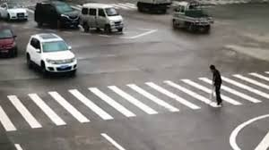

# Image Captioning (Keras)

Image Captioning System that generates natural language captions for any image.

## Dataset
The model is trained on [Flickr8k Dataset](https://illinois.edu/fb/sec/1713398)

Although it can be trained on others like Flickr30k or MS COCO

## Performance
The model has been trained for 20 epoches on 6000 training samples of Flickr8k Dataset. It acheives a `BLEU-1 = ~0.60` with 1000 tes samples.

----------------------------------

## Requirements
- tensorflow
- keras
- numpy
- h5py
- progressbar2

## Scripts

- __caption_generator.py__: The base script that contains functions for model creation, batch data generator etc.
- __prepare_data.py__: Extracts features from images using VGG16 imagenet model. Also prepares annotation for training. Changes have to be done to this script if new dataset is to be used.
- __train_model.py__: Module for training the caption generator.
- __eval_model.py__: Contains module for evaluating and testing the performance of the caption generator, currently, it contains the [BLEU](https://en.wikipedia.org/wiki/BLEU) metric.

## Usage

### Pre-trained model
1. Download pre-trained weights from repository.
2. Make sure `model_weight.h5` to `models` directory
3. Prepare data using `python prepare_data.py`
4. For inference on example image, run: `python eval_model.py -i [img-path]`

### From scratch
After the requirements have been installed, the process from training to testing is fairly easy. The commands to run:
1. `python prepare_data.py`
2. `python train_model.py`
3. `python eval_model.py`

After training, evaluation on an example image can be done by running:  
`python eval_model.py -m [model-checkpoint] -i [img-path]`

## Results

Image | Caption 
--- | --- 
 | **Generated Caption:**  A white and black dog is running through the water
 | **Generated Caption:** man in red shirt is smilling
 | **Generated Caption:** Group of people are sitting in front of an amusement the street

